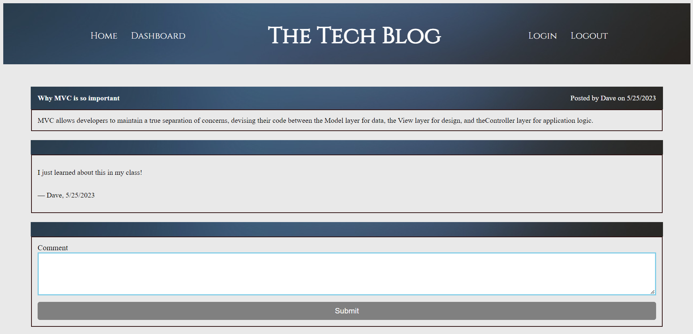
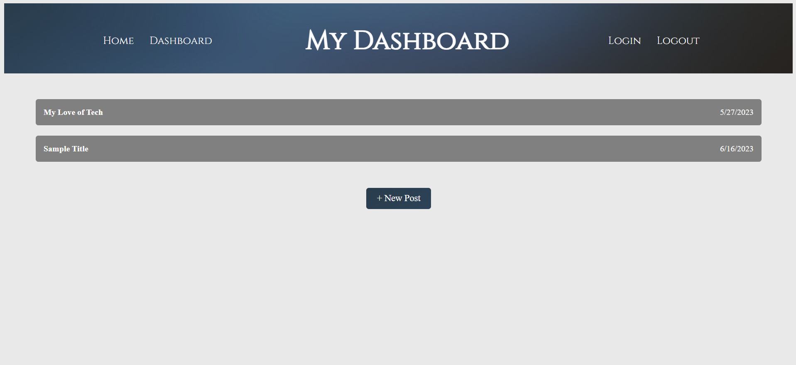
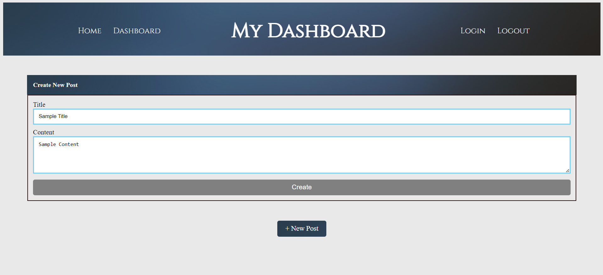

# green-tech-blog

## Description
This project is to create a tech blog where a user can sign-up or login to a personal profile. After the user is logged in they can create a post to the main tech blog thread. In the profile the user can also edit there posts or delete there posts. On the main thread the user can can click on other peoples blogs and leave comments. 
## Table of contents
- [Mock-up](#Mock-up)
- [Installation](#Installation)
- [Usage](#Usage)
- [Contribution](#Contributing)
- [Test](#Test)
- [Questions](#Questions)
- [Diployment Links](#Questions)
## Mock-up

Landing Page - Main Blog Thread

Comment Section - Click The Blog Title To Open

My Dashboard - Login To Create, Update, And Delete Your Blogs

Create Post - Click New Post And Fill Out New Post Form

Edit and Delete - Click Saved Post In Dashboard To Update Or Delete Post

## Installation
dotenv

express

mysql2

sequelize
## Usage
mysql -u root -p

source db/schema.sql

npm run seed

npm start
## Contributing
Steven Green

## Questions
GitHub Username: [mrgreen12375](https://github.com/mrgreen12375)

Email Address: [ste2144105@gmail.com](ste2144105@gmail.com)
## Deployment Links
Heroku: https://green-tech-blog.herokuapp.com/

GitHub Repo: https://github.com/mrgreen12375/green-tech-blog